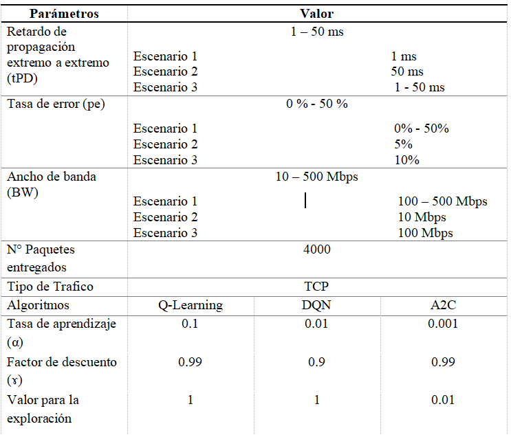

# DRL-IT-Management

Este proyecto implementa algoritmos de aprendizaje por refuerzo profundo (Deep Reinforcement Learning) para la gestión del Internet Táctil, con el objetivo de minimizar la latencia y la pérdida de paquetes, mejorando así el rendimiento general de la red.

## Características 
- Entorno personalizado que simula una red táctil con parámetros configurables.
- Algoritmos implementados:
  
    Q-Learning (algoritmo base de Reinforcement Learning)
  
    Deep Q-Network (DQN) - Para espacios de acciones discretas
  
    Advantage Actor Critic (A2C) - Para espacios de acciones continuas

- Tres escenarios de prueba con diferentes parámetros de red.
- Métricas de evaluación para comparar el rendimiento entre algoritmos.
- Notebook de Jupyter con experimentos reproducibles y visualizaciones.

## Tecnologías Utilizadas 📋
- Jupyter Notebook
- Python 3.8.7
- Gym
- Numpy
- Pandas
- Tensorflow/keras
- Scikit-learn

## Instalación 🔧
1. Clona el repositorio:
   git clone https://github.com/DuniaMarquina/DRL-IT-Management.git
   
   cd DRL-IT-Management

2. Crear un entorno virtual (recomendado)

   python -m venv venv

   source venv/bin/activate    # En Linux/macOS

   venv\Scripts\activate     

3. Instala las dependencias:

   pip install -r requirements.txt

## Uso
1. Abre Jupyter Notebook:

   jupyter notebook

2. Navega a la carpeta y ejecuta cualquiera de los notebooks disponibles. 
   - El notebook proyecto simula el escenario 1 y 2 según el valor de los parámetros que se asignen.
   - El notebook escenario 3 simula el escenario 3 (igualmente se debe modificar los parámetros para observer su comportamiento de acuerdo a los parámetros).

3. Cada notebook muestra el valor de las métricas y gráficas comparativas entre los algoritmos.

## Configuración de las simulaciones ⚙️

Escenario 1: Red con un entorno dinámico.

Escenario 2: Red con un entorno menos dinámico.

Escenario 3: Red con mayor dinamismo (similar a aplicaciones de teleoperación de TI).

Los escenarios permiten evaluar la robustez y adaptabilidad de cada algoritmo bajo distintas condiciones de red.

📊 Métricas de Evaluación

Recompensa acumulada: suma de recompensas obtenidas en cada episodio.

Rendimiento útil acumulado: medida de eficiencia de la red.

Retardo promedio móvil (ms): permite analizar la tendencia del retardo en una ventana móvil de los últimos W paquetes transmitidos.

Tasa de pérdida de paquetes (%): porcentaje de paquetes perdidos.

Tasa de paquetes demorados (%): porcentaje de paquetes con retraso (suelen ser inútiles para aplicaciones sensibles como TI).

## Resultados
   - Los resultados mostraron la eficacia de los algoritmos DRL en diversos entornos.

## 👩‍💻 Autor 
Dunia Marquina

## Licencia 📄
